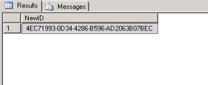
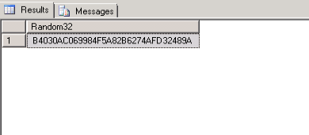
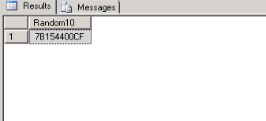
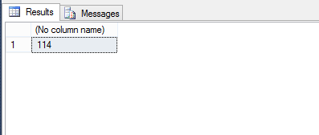
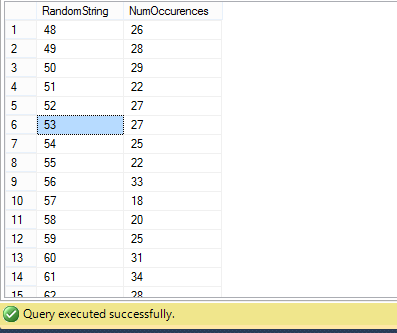
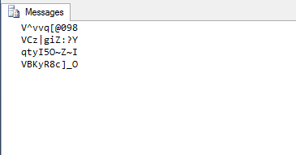
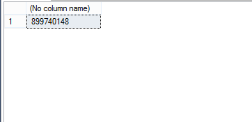

Why would you need to make a string of random letters and numbers via SQL? You probably don't, but you might if you want to load a database with sample data for the purpose of testing queries or if you want to create a temporary password for an account, whose credentials are stored in a SQL database. Most importantly, though, it's an interesting task, because it allows us to explore some of the more uncommon functions in SQL Server. It's also a fun topic, because you don't need to be working in any particular database; we'll use SQL Server to make the data out of thin air!

### A First Attempt: _NEWID()_

At first glance, there is a datatype that just looks like random letters and numbers: uniqueid. So, if you could generate a bunch of uniqueid's, you'd have your random strings. Fortunately, there is a SQL Server function, NEWID(), that spits out a new GUID (globally unique identifier). You may not use this function all that much, since uniqueidentifier columns are usually identity columns and autogenerate on inserts. Here's your chance to try it out.

```sql
SELECT NewID() AS [NewID]
```


..and just like that you have a new GUID. It looks like a 36 character string, but four of the characters are dashes. To remove these, we can simply run

```sql
SELECT REPLACE(NEWID(),'-','') AS Random32
```


At this point, you can use substring functions to get however many characters you want. 

```sql
SELECT CONVERT(nvarchar(10),LEFT(REPLACE(NEWID(),'-',''),10)) AS Random10
```


### The Complications

That's pretty cool, and if you're in a hurry, it will likely do the trick. But there are a few issues with our use of _NEWID()_, and we should dig a little deeper. The first issue is somewhat academic but important nonetheless. If you are taking substrings of a GUID, these substrings are not guaranteed to be unique. Raymond Chen has [a great blog post](https://blogs.msdn.microsoft.com/oldnewthing/20080627-00/?p=21823) that explains how GUIDs are made and why substrings are not necessarily unique. 

You might not care about this if you don't care about unique data or are willing to add code to make sure that a substring of a GUID has not already been used. But the second issue is that GUIDs can only provide a very restricted kind of sample data. If you generate enough GUIDs, you will notice that they only seem to contain the numbers 0-9 and the upper-case letters A-F. This is because GUIDs are written using hexidecimal digits, and hexidecimal is a numbering system with only 16 numbers (usually the 10 digits plus the first six letters of the alphabet). So even though your GUID looks like a string and can be converted to a string, it probably cannot contain your name (unless your name is "DEB" or "BEA" or "ABE"). This is a problem if you want your random strings to be able to have any character in the Latin alphabet or to have a character distribution that somewhat resembles the distribution in English. The moral is that you can use GUID's to get random strings, but you only draw from a set of 16 characters, and if you only want to get random letters, you're restricted to ~23% of the alphabet. Characters besides "-" are also off the table.


### A New Strategy: ASCII and _RAND()_

If you've used the _CHAR()_ function before, it's probably been to manipulate line breaks in data, which can mess with your importing and exporting. But you can use the _CHAR()_ function for more than just finding _CHAR(10)_ and _CHAR(13)_; you can use it to generate any ASCII character by using the codes from 0-255. There's a nice stretch of numbers, 48-127, whose ASCII symbols represent the numbers 0-9, all the lowercase and uppercase letters, and some common punctuation marks. If we could randomly select a number between 48 and 127, then we would have a pretty good base for generating random strings. There is one funcion, _RAND()_, that will give you a random number, but not an integer: it gives a decimal (float) between 0 and 1. However, there is a clever way to get around this. Take the maximum number you want in your pool of random numbers and add one to it (127 +1). Then subtract the lowest number you want in the pool, which in this case is 48 (so 128-48). Multiply that by _RAND()_. In our case, we multiply 80 by a random decimal between 0 and 1. If we convert the result to an integer (and thus truncate the decimal), we will have a number between 0 and 79 (we can't get 80, since _RAND()_ will never return 1). What we really wanted was a number between 48 and 127, and we can simply get that by adding 48 to our results. Here's what our final statement looks like:

```sql
SELECT CAST((128 - 48 )*RAND() + 48  AS INTEGER)
```


We can even whip up a quick table to see the distribution of numbers. 

```sql
CREATE TABLE RandomStringTest 
(
RandomString smallint
)

DECLARE @counter smallint;  
SET @counter = 1;  
WHILE @counter < 2000 
   BEGIN  
      INSERT INTO RandomStringTest SELECT CAST((128 - 48 )*RAND() + 48 AS INTEGER)
      SET @counter = @counter + 1  
   END;  
GO  


SELECT RandomString, COUNT(*) AS NumOccurences FROM RandomStringTest
GROUP BY RandomString
ORDER BY RandomString ASC
```


The last step is to use the _CHAR()_ on our random integer:

```sql
SELECT CHAR(CAST((128 - 48)*RAND() + 48 AS INTEGER))
```

We now have a nice way to generate a random alphanumeric character (plus a few others). We can make a simple stored procedure to create random strings of arbitrary length.

```sql
CREATE PROCEDURE RandomStringMaker (@length smallInt, @iterations smallInt)
AS
DECLARE @Counter smallint;
SET @Counter = 1;

DECLARE @tempString varchar(max);

DECLARE @littleCounter smallint;

WHILE @Counter < @iterations + 1
BEGIN
	SET @tempString = ''
	SET @littleCounter = 1;
	WHILE @littleCounter < @length + 1 
		BEGIN 
			Set @tempString = @tempString + CHAR(CAST((128 - 48 )*RAND() + 48  as integer))
			Set @littleCounter = @littleCounter + 1;
		END;
		PRINT @tempString;
		SET @Counter = @Counter+1;
	END;
GO
```

When we call it, we get a result like this:

```sql
EXEC RandomStringMaker 10, 4
```


You can play around the ASCII range to change the range of characters you draw from. Kinda neat, right? This idea was inspired by the first reply in [this old SQLTeam forum post](http://www.sqlteam.com/forums/topic.asp?TOPIC_ID=21132).

### Another Idea: The _CHECKSUM()_ Function

We've covered two fairly straightforward and useful options for generating random strings. Still, there are some other intereting options. One is to use the _CHECKSUM()_ function in conjunction with the _NEWID()_ function and the modulo operator (note: this only works in SQL Server 2008 and after) The _CHECKSUM()_ function takes an input (various types are acceptable) and returns an integer. Since, _NEWID()_ give us a random output, if we take the absolute value of applying _CHECKSUM()_ to a _NEWID()_, we will have a random positive integer.

```sql
SELECT ABS(CHECKSUM(NEWID()))
```


These numbers are pretty big, and we will need to bump them down to get them in the ASCII range. To do that, we'll use the modulo function. In the last section, we were interested in a range of 80 ASCII numbers, so we'll use modulo 80 (the modulo function gives you the remainder left over when dividing by a number, so % 80  can only return 0-79). We'll need to bump the number back up, so we'll add 48, since the lowest ASCII number we want is 48. This is the final result:

```sql
SELECT CHAR(48 + ABS(CHECKSUM(NEWID())) % 80)
```

and it works just like our old friend:

```sql
SELECT CHAR(CAST((128 - 48)*RAND() + 48 AS INTEGER))
```

Using _CHECKSUM()_ was inspired by [the first reply on this other post on the SQLTeam forum](http://www.sqlteam.com/forums/topic.asp?TOPIC_ID=187665).

### Conclusion

We've reached our goal of figuring out how to generate random strings, so we can call it a post. This is by no means an exhaustive overview. For example, the function _CRYPT_GEN_RANDOM()_ is another acceptable starting point for creating a random string. In any case, I plan to return to this topic soon, and take a similar walk through random data, except using Oracle instead of SQL Server.