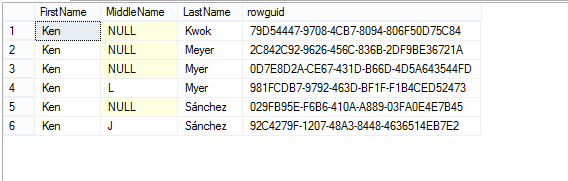
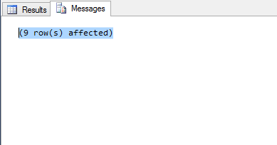
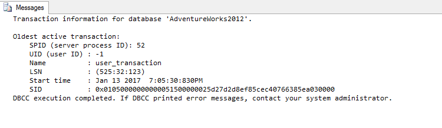

At a former job, a coworker opined that Oracle was a better RDBMS than SQL Server, because it allowed you to undo (rollback) your update, insert, and delete statements. No one batted an eye at this statement, since we were a department full of feral SQL ninjas who regularly modified SQL Server databases, without ever explicity creating a transaction. We just made sure we had backups.

It is true that transactions can be less visible in SQL Server - if you use Oracle with SQL Developer there is always that nice rollback button at the top of the screen. The solution is that when you use SQL Server you should **always** explicitly wrap your update, insert, and delete statements in a transaction. This will allow you to rollback in the case of any surprises. 

### An Example

One good piece of advice is to always run a SELECT statement before you UPDATE, DELETE, or (sometimes) INSERT. So suppose we are in the AdventureWorks2012 database, and we want to update the name of anyone named "Ken" to "Kenjamin." First you run your SELECT statemnt and find that there are six people with the firstname "Ken."

```sql
SELECT [FirstName]
      ,[MiddleName]
      ,[LastName]
      ,[rowguid]
  FROM [AdventureWorks2012].[Person].[Person]
  WHERE FirstName= 'Ken'
```


It seems like there are probably duplicates here, but that's not your problem. Ok, so you know when you do your update, you should get a message that says "6 row(s) affected." If you don't something went wrong, and you want to be able to make sure you can do something about it if something goes wrong. Here's how you can make that happen. First type 

```sql
BEGIN TRANSACTION
```

and run that statement. You're now in the land of second chances. If you run your update statement

```sql
UPDATE [AdventureWorks2012].[Person].[Person]
SET FirstName = 'Kenjamin'
WHERE FirstName= 'Ken'
```

and you see this



you have the option to immediately undo it. Just type and run this:

```sql
ROLLBACK
```

Boom! It's like you never ran your update. In general, you probably aren't going to make mistakes like this too often (...right?), so I recommend being optimistic and writing out your SQL UPDATES and DELETES like this:

```sql
BEGIN TRANSACTION

UPDATE [AdventureWorks2012].[Person].[Person]
SET FirstName = 'Kenjamin'
WHERE FirstName= 'Ken'

SELECT [FirstName]
      ,[MiddleName]
      ,[LastName]
      ,[rowguid]
  FROM [AdventureWorks2012].[Person].[Person]
  WHERE FirstName= 'Ken'

COMMIT TRANSACTION
```

First, just run "BEGIN TRANSACTION" then run your UPDATE statement. Run the SELECT statement to confirm that your UPDATE took effect correctly. Then if everything looks good, run "Commit Transaction." If things don't look good, immediately abort by typing out and running "ROLLBACK."

Explicitly using transactions is even more essential, when you are running multiple DML statements and they are dependent on each other. This way your statements will all be committed together, or they won't take effect at all.


### A Caveat

If you get interuppted, you might forget if you already started a transaction. The best thing to do in this situation is to run

```sql
DBCC Opentran
```

If you started a transaction, ran a statement that changes your database, and you did not commit or rollback, you will see a message like this:



It is essential to make sure that you close every transaction you open. Otherwise, you may block any other transaction that tries to modify or even read from the table you are changing. SQL Server Management Studio will help you out and alert you if you try to close a query window, while you still have an open transaction: a good reason to make sure you close your Management Studio periodically!

### Final Thought

I highly recommend getting into the habit of running a "BEGIN TRANSACTION" statement before executing any statement that will change your database. It is almost essential when running related statements sequentially and still good practice if you're only executing a single statement. It is of course still a good idea to make backups of the tables you're updating, if you have anything less than full confidence in the statements you are running.
