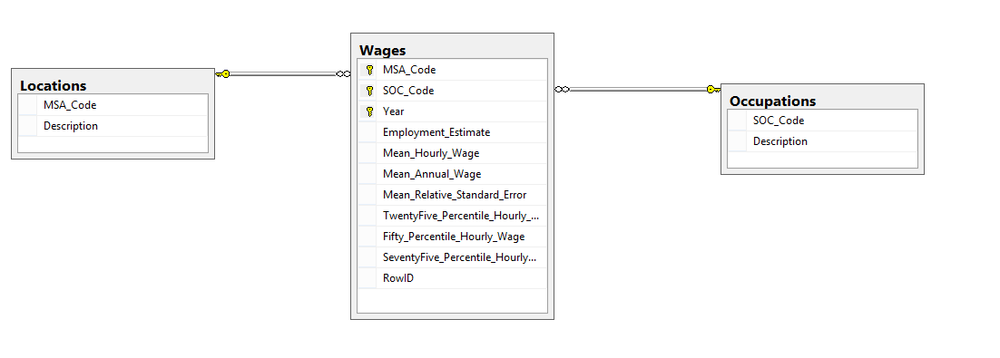
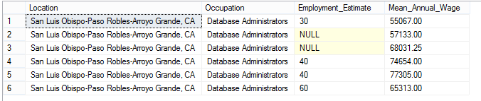

A few months ago, I read an article in a local paper about the low(ish) wages and high cost of living in the area. This was no surprise, but I was intrigued by a data set the article cited. The California government and the Occupational Employment Statistics and Wages program has [a page with hundreds of Excel sheets](http://www.labormarketinfo.edd.ca.gov/data/oes-employment-and-wages.html) with pretty fine-grained data on wages in California broken done by region and occupation. For example, the data could provide the average salary for a DBA in San Luis Obispo for each of the last five years. I don't know anywhere else you could find this sort of information, so I decided to get the data into a more manageable form.

### Making the Dataset

The OES gave you the option download a year's worth of data in a zip file, which contains ~35 spreadsheets (one for each location). I downloaded the sets from 2011-2016 and unzipped them into a folder. I wanted to combine all of these sheets and put them in a format that would work well for a SQL Server database. Looking at the data, I decided I would want the database to have three tables: one with locations, one with occupations, and one with the salary data. There would be foreign keys that would validate the data in the salary table with the records in the locations and occupations tables. Here's the database diagram for it. I went a little bit overboard and made a composite primary key on the MSA_Code (for location), SOC_Code (for specific occupation), and the year.



Once I had a database design I liked, the next step was to convert the data in the spreadsheets into a format I could import into SQL Server. At first I was discouraged by the formatting of the data, but I broke it down step by step figured out how to get each spreadsheet into the right format. One nice feature I noticed is that each spreadsheet had the year at the end of the filename, so extracting the year (which wasn't in the spreadsheet contents) would be straightforward. Essentially I made three spreadsheets (one for each table), looped through the raw spreadsheets from OES, removed the unnecessary data, and then copied the relevant data into the three spreadsheets I had set up. I just used VBA to script it. My biggest hiccup came from forgetting that the integer datatype in Excel only goes up to 32,678, which caused crashes when my wages spreadsheet reached that many rows. Changing the integers to long quickly fixed the problem. In the end, I had three spreadsheets to import into my three tables in SQL Server. I then made a view that denormalized the data for easier querying (called "Total Data"). Here's how I found the average salary for DBA's in SLO:

```sql
SELECT Location, Occupation, Employment_Estimate, Mean_Annual_Wage FROM TotalData
WHERE msa_code = '042020' and soc_code = '15-1141'
```


Yup, that employment estimate is people, not hundreds of people or something. I haven't yet had a chance to analyze any of the data, but I certainly will in future posts. For now, you can download the SQL Server database with its 96,751 salary records from [my Github project page](https://github.com/andyspecht/OES-California-SQL).