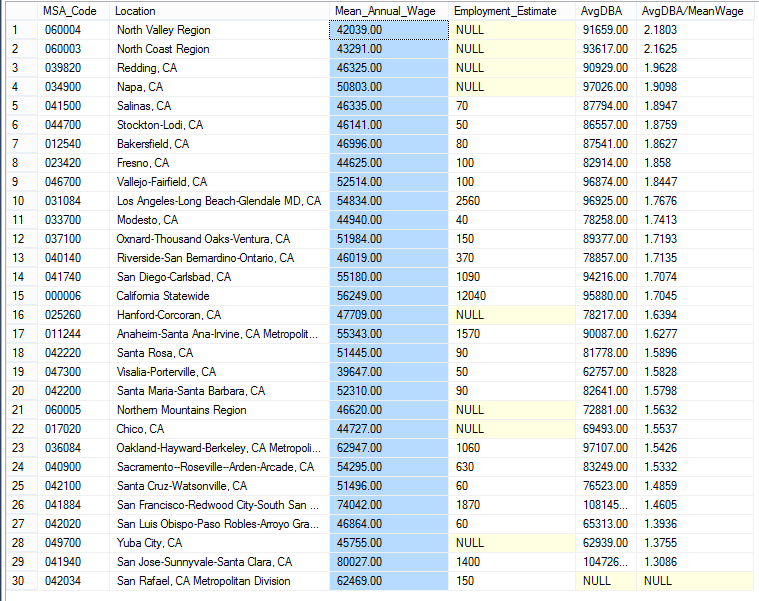

In my [last post](https://andyspecht.github.io/2017-01-29-new-project-wages-ca/) I talked about a new database of California salary data I put together (get it [here](https://github.com/andyspecht/OES-California-SQL)). I've had some time to begin looking at the data, and I started with the thing that caught my eye the first time I saw the raw data: it has DBA salaries broken down by geographic region. So first, let's get a sense of how well being a DBA pays in California, and we can compare it to the average salary for each region of California in 2016.


```sql
WITH AverageSal
AS
	(
	--Get Average Salary for Each Region
	SELECT MSA_Code, Location, Mean_Annual_Wage 
	FROM totaldata
	where [year] = '2016' and SOC_Code = '00-0000'
	)
,
DBAByLoc
AS 
(
	--Get Averge DBA Salary for Each Region
	SELECT MSA_Code,  Mean_Annual_Wage AS AvgDBA, Employment_Estimate 
	FROM totaldata
	WHERE [year] = '2016' AND soc_code = '15-1141'
)
SELECT 
AverageSal.MSA_Code
,AverageSal.Location
,AverageSal.Mean_Annual_Wage
,DBAByLoc.Employment_Estimate
,DBAByLoc.AvgDBA
,(DBAByLoc.AvgDBA / AverageSal.Mean_Annual_Wage) AS [AvgDBA/MeanWage]
FROM AverageSal INNER JOIN DBAByLoc
ON AverageSal.MSA_Code = DBAByLoc.MSA_Code
ORDER BY (DBAByLoc.AvgDBA / AverageSal.Mean_Annual_Wage) DESC
```



Let's remove all of the sparsely-populated regions without a DBA employment estimate and San Rafael without an average DBA salary. When we do this, it's a bit more cleaned up:

**MSA_Code** | **Location** | **Mean_Wage** | **DBAs** | **AvgDBA** | **AvgDBA/MeanWage**
041500	 | 	Salinas, CA	 | 	$46,335	 | 	70	 | 	$87,794	 | 	1.8947	 | 
044700	 | 	Stockton-Lodi, CA	 | 	$46,141	 | 	50	 | 	$86,557	 | 	1.8759	 | 
012540	 | 	Bakersfield, CA	 | 	$46,996	 | 	80	 | 	$87,541	 | 	1.8627	 | 
023420	 | 	Fresno, CA	 | 	$44,625	 | 	100	 | 	$82,914	 | 	1.858	 | 
046700	 | 	Vallejo-Fairfield, CA	 | 	$52,514	 | 	100	 | 	$96,874	 | 	1.8447	 | 
031084	 | 	Los Angeles-Long Beach-Glendale MD, CA	 | 	$54,834	 | 	2560	 | 	$96,925	 | 	1.7676	 | 
033700	 | 	Modesto, CA	 | 	$44,940	 | 	40	 | 	$78,258	 | 	1.7413	 | 
037100	 | 	Oxnard-Thousand Oaks-Ventura, CA	 | 	$51,984	 | 	150	 | 	$89,377	 | 	1.7193	 | 
040140	 | 	Riverside-San Bernardino-Ontario, CA	 | 	$46,019	 | 	370	 | 	$78,857	 | 	1.7135	 | 
041740	 | 	San Diego-Carlsbad, CA	 | 	$55,180	 | 	1090	 | 	$94,216	 | 	1.7074	 | 
**000006** | 	**California Statewide**	 | 	**$56,249**	 | 	**12040**	 | 	**$95,880**	 | 	**1.7045**	 | 
011244	 | 	Anaheim-Santa Ana-Irvine, CA  | 	$55,343	 | 	1570	 | 	$90,087	 | 	1.6277	 | 
042220	 | 	Santa Rosa, CA	 | 	$51,445	 | 	90	 | 	$81,778	 | 	1.5896	 | 
047300	 | 	Visalia-Porterville, CA	 | 	$39,647	 | 	50	 | 	$62,757	 | 	1.5828	 | 
042200	 | 	Santa Maria-Santa Barbara, CA	 | 	$52,310	 | 	90	 | 	$82,641	 | 	1.5798	 | 
036084	 | 	Oakland-Hayward-Berkeley, CA | 	$62,947	 | 	1060	 | 	$97,107	 | 	1.5426	 | 
040900	 | 	Sacramento--Roseville--Arden-Arcade, CA	 | 	$54,295	 | 	630	 | 	$83,249	 | 	1.5332	 | 
042100	 | 	Santa Cruz-Watsonville, CA	 | 	$51,496	 | 	60	 | 	$76,523	 | 	1.4859	 | 
041884	 | 	San Francisco-Redwood City-South San Francisco, CA  | 	$74,042	 | 	1870	 | 	$108,145	 | 	1.4605	 | 
042020	 | 	San Luis Obispo-Paso Robles-Arroyo Grande, CA	 | 	$46,864	 | 	60	 | 	$65,313	 | 	1.3936	 | 
041940	 | 	San Jose-Sunnyvale-Santa Clara, CA	 | 	$80,027	 | 	1400	 | 	$104,726	 | 	1.3086	 | 

So, the wage for a DBA is above average everywhere. Salaries look especially good in areas with relatively few DBA's and low average salaries. One exception seems to be San Luis Obispo, which has one of the lowest average annual wage but also has one of the lowest average DBA salaries as well. It's also peculiar that the heart of Silicon Valley is at the bottom of this list, and it has both a very high average wage and a very high average DBA wage. When we are looking at DBA salaries, probably a better comparison would be to salaries for other tech jobs - not just to the average salary for all occupations. People who are interested in a career as a DBA would probably weigh that option against other tech fields, specifically. 

Fortunately our data has an easy way to make this comparison. All of the (non-management) tech jobs have a SOC code that starts with 15. Specifically, with "15-1." These include Systems Analysts, Security Analysts, Computer Programmers, Software Developers, Web Developers, and Support Specialists (among others). With a quick modification to our query, we can see how DBA salaries stack up to those of their colleagues in tech.

```sql
WITH AverageSal
AS
(
SELECT Location, AVG(Mean_Annual_Wage) AS TechAvg FROM totaldata
where SOC_Code LIKE '15-1%' AND [year] = '2016'
GROUP BY Location
)
, DBAByLoc
AS 
(
SELECT Location, Mean_Annual_Wage AS AvgDBA FROM totaldata
WHERE soc_code = '15-1141' AND Employment_Estimate IS NOT NULL
AND [year] = '2016'
)
SELECT AverageSal.Location,  AverageSal.TechAvg, DBAByLoc.AvgDBA,
(DBAByLoc.AvgDBA / AverageSal.TechAvg) AS [AvgDBA/AvgTech]
FROM AverageSal INNER JOIN DBAByLoc
ON AverageSal.Location = DBAByLoc.Location
WHERE DBAByLoc.AvgDBA IS NOT NULL
ORDER BY (DBAByLoc.AvgDBA / AverageSal.TechAvg) DESC
```

|**Location** | **TechAvg** | **AvgDBA** | **AvgDBA/AvgTech** |
Vallejo-Fairfield, CA	 | 	$88,187.33	 | 	$96,874.00	 | 	1.0985	 | 
Stockton-Lodi, CA	 | 	$82,132.67	 | 	$86,557.00	 | 	1.0538	 | 
Bakersfield, CA	 | 	$85,255.42	 | 	$87,541.00	 | 	1.0268	 | 
Fresno, CA	 | 	$80,790.67	 | 	$82,914.00	 | 	1.0262	 | 
Los Angeles-Long Beach-Glendale MD, CA	 | 	$95,137.62	 | 	$96,925.00	 | 	1.0187	 | 
San Diego-Carlsbad, CA	 | 	$92,609.23	 | 	$94,216.00	 | 	1.0173	 | 
San Francisco-Redwood City-South San Francisco, CA Metropolitan Division	 | 	$110,838.08	 | 	$108,145.00	 | 	0.9757	 | 
Modesto, CA	 | 	$80,992.92	 | 	$78,258.00	 | 	0.9662	 | 
Riverside-San Bernardino-Ontario, CA	 | 	$81,735.33	 | 	$78,857.00	 | 	0.9647	 | 
Anaheim-Santa Ana-Irvine, CA Metropolitan Division	 | 	$93,379.31	 | 	$90,087.00	 | 	0.9647	 | 
Oakland-Hayward-Berkeley, CA Metropolitan Division	 | 	$103,583.69	 | 	$97,107.00	 | 	0.9374	 | 
**California Statewide**	 | 	**$102,350.62**	 | 	**$95,880.00**	 | 	**0.9367**	 | 
Oxnard-Thousand Oaks-Ventura, CA	 | 	$95,722.85	 | 	$89,377.00	 | 	0.9337	 | 
Santa Rosa, CA	 | 	$89,202.40	 | 	$81,778.00	 | 	0.9167	 | 
Santa Maria-Santa Barbara, CA	 | 	$90,808.00	 | 	$82,641.00	 | 	0.91	 | 
Santa Cruz-Watsonville, CA	 | 	$85,112.18	 | 	$76,523.00	 | 	0.899	 | 
Sacramento--Roseville--Arden-Arcade, CA	 | 	$93,014.83	 | 	$83,249.00	 | 	0.895	 | 
San Jose-Sunnyvale-Santa Clara, CA	 | 	$119,742.23	 | 	$104,726.00	 | 	0.8745	 | 
Salinas, CA	 | 	$100,652.92	 | 	$87,794.00	 | 	0.8722	 | 
Visalia-Porterville, CA	 | 	$75,188.73	 | 	$62,757.00	 | 	0.8346	 | 
San Luis Obispo-Paso Robles-Arroyo Grande, CA	 | 	$82,312.58	 | 	$65,313.00	 | 	0.7934	 |  

On this comparison, San Luis Obispo does even worse, with DBA's making only 79% of what the average tech worker in SLO makes. Overall, the best large labor markets for DBA's look to be down south in LA and San Diego, with DBA's making more than the average tech worker. I find the discrepancy between San Jose and San Francisco interesting. I always thought of these labor markets as very similar, but in San Francisco, DBA's make almost as much as the average tech worker, whereas in San Jose they only make 87% as much.

There's a lot more to explore in this data, and I'm sure I'll keep coming back to it over time. For now, I just want to address one issue: we're only looking at one year, a single snapshot, so we might not be getting the full story of how these areas and salaries compare. Let's run the same query as last time (DBA vs avg. tech), but instead average the salaries from the years 2011-2016. We'll just look at the top 5/bottom 4 and state average.

```sql
WITH AverageSal
AS
(
SELECT Location, AVG(Mean_Annual_Wage) AS TechAvg FROM totaldata
where SOC_Code LIKE '15-1%'  
GROUP BY Location
)
, DBAByLoc
AS 
(
SELECT Location, AVG(Mean_Annual_Wage) AS AvgDBA FROM totaldata
WHERE soc_code = '15-1141' AND Employment_Estimate IS NOT NULL
GROUP BY Location
)
SELECT AverageSal.Location, AverageSal.TechAvg, DBAByLoc.AvgDBA,
(DBAByLoc.AvgDBA / AverageSal.TechAvg) AS [AvgDBA/AvgTech]
FROM AverageSal INNER JOIN DBAByLoc
ON AverageSal.Location = DBAByLoc.Location
WHERE DBAByLoc.AvgDBA IS NOT NULL
ORDER BY (DBAByLoc.AvgDBA / AverageSal.TechAvg) DESC
```


|**Location** | **TechAvg** | **AvgDBA** | **AvgDBA/AvgTech** |
Modesto, CA	 | 	$77,349.88	 | 	$78,391.18	 | 	1.0134	 | 
Vallejo-Fairfield, CA	 | 	$85,605.99	 | 	$86,362.10	 | 	1.0088	 | 
Los Angeles-Long Beach-Glendale MD, CA	 | 	$90,129.41	 | 	$90,896.25	 | 	1.0085	 | 
Santa Cruz-Watsonville, CA	 | 	$81,470.55	 | 	$80,223.07	 | 	0.9846	 | 
San Francisco-Redwood City-South San Francisco, CA Metropolitan Division	 | 	$103,724.14	 | 	$101,461.65	 | 	0.9781	 | 
**...California Statewide...**	 | 	**$95,382.56**	 | 	**$89,610.62**	 | 	**0.9394**	 | 
San Luis Obispo-Paso Robles-Arroyo Grande, CA	 | 	$75,359.31	 | 	$68,084.75	 | 	0.9034	 | 
Bakersfield, CA	 | 	$84,974.77	 | 	$74,764.92	 | 	0.8798	 | 
Salinas, CA	 | 	$88,503.61	 | 	$77,461.44	 | 	0.8752	 | 
Oxnard-Thousand Oaks-Ventura, CA	 | 	$89,092.42	 | 	$76,044.57	 | 	0.8535	 | 


When we look at 2011-2016, we see a lot less variation. Instead of DBA's making between 79% - 110% of the average tech worker, the range is 85%-101%. Los Angeles retains its position as the best-paying large metro area for DBA's, relative to other tech jobs. San Luis Obispo also climbs out of the bottom spot - there's a lot of variation in the average DBA wage for SLO in the last five years, and the average wage actually decreased by $12,000 between 2015 and 2016 (the number of DBA's increased 50%, so there were likely a number of more junior DBA's driving down the average salary). Statewide, being a DBA results in nearly average (though slightly lower) pay, relative to other tech jobs.

That's enough about DBA's for now. Next time I visit this data, we will take a closer look at some other tech job titles as well. It would also be interesting to compare this data to the recent salary survey they did over at [Brent Ozar](https://www.brentozar.com/archive/2017/01/2017-data-professional-salary-survey-results/).