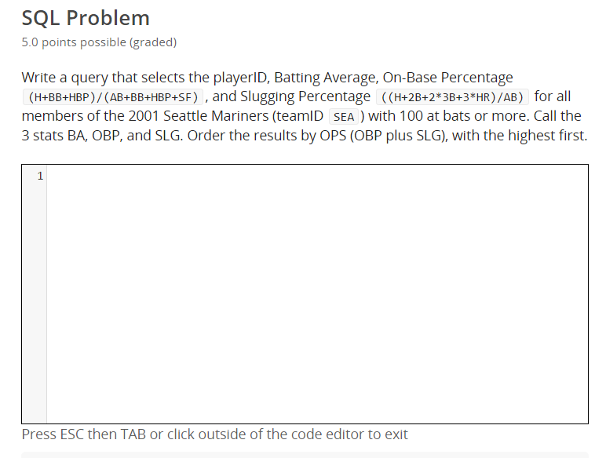
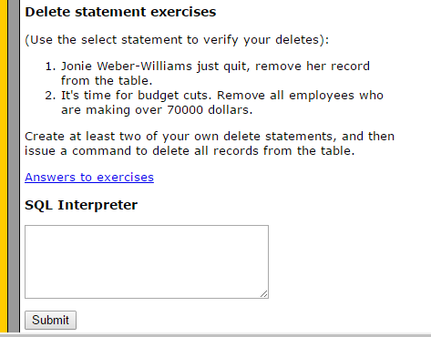
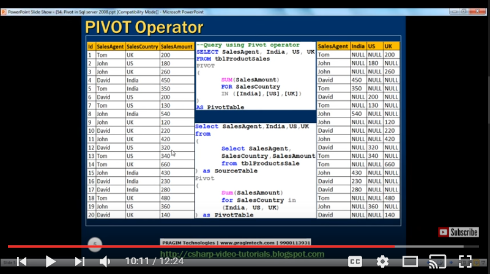

It seems like half of the discussion about SQL on the internet is about resources for learning SQL. Many of the frequent suggestions are ones that came out after I learned the basics, and so I haven't used them. I want to take a moment to highlight three free internet resources that were vital in my SQL development.

### 1) [Sabermetrics 101: Introduction to Baseball Analytics](https://www.edx.org/course/sabermetrics-101-introduction-baseball-bux-sabr101x-0)

Wait, what? This course from edX was actually my first exposure to SQL and sparked my interest in the language. The first half of the course is a fantastic overview of baseball analytics and its history, and it seamlessly integrates learning SQL by querying [a comprehensive baseball statistics database](http://www.seanlahman.com/baseball-archive/statistics/). You can learn about slash stats and build some non-trivial SQL queries that will return interesting information. For example:

I found the difficulty level to be fantastic. Many of the queries are challenging for a beginner, but the course guides you through all of the techniques you will need to write them. I highly recommend this course (at least the first half - the second half is on R, and I didn't finish it).

### 2) [SQLCourse](http://www.sqlcourse.com/)

At a first glance, this looks like a standard (and maybe a bit out-dated) SQL tutorial, but it has an important advantage: it has a SQL interpreter that allows for creating/dropping tables and updates/deletes. So many SQL tutorials only really cover selecting. 

It's somewhat confusing, but the tutorial is split into two parts [here](http://www.sqlcourse.com/) and [here](http://www.sqlcourse2.com/). You can cover all of the material pretty quickly, and this is a great choice for an absolute beginner.

### 3) [Kudvenkat's SQL Server tutorial for beginner](https://www.youtube.com/playlist?list=PL08903FB7ACA1C2FB)

This series of 136 Youtube videos is a fantastic resources for moving out of the SQL basics and into more intermediate and advanced topics. Kudvenkat breaks down difficult concepts very well and progresses through ideas in a way that makes sense. For example, his explanation of PIVOT in SQL Server is still my go to resource when I need to pivot in SQL Server about twice a year. He starts with the basics, explains complications, and provides a more complex but satisfying solution.

These are great videos that you can squeeze in when you have some free moments. I like them so much that I'm working through his C# videos now.