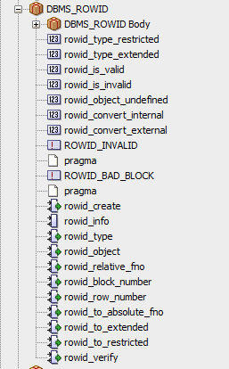

If you're looking at PL/SQL code long enough, you'll eventually run into a function or procedure that is completely foreign to you. You've never seen it before, you have no idea what it does, and you have no idea where the code for the function or procedure is. Often in Oracle databases, [functions and procedures are grouped together in packages](https://asktom.oracle.com/pls/asktom/f?p=100:11:0::::P11_QUESTION_ID:7452431376537), so you cannot just use SQL Developer's sidebar to browse through the functions and procedures.


Digging through the packages would take forever. Fortunately there is a short query you can run to find which package contains the the function or procedure you are looking for. This will allow you to quickly track down the definition for it. As an example, we will use a function that we all have in our Oracle databases: ROWID_VERIFY

```sql
select OWNER, OBJECT_NAME, PROCEDURE_NAME, OBJECT_TYPE 
from ALL_PROCEDURES
where PROCEDURE_NAME like upper('ROWID_VERIFY')
```


Ok, so the ROW_ID function is in the DBMS_ROWID package, owned by SYS. We can use this information to quickly look up where ROWID_VERIFY is defined:



Now if your query does not return any results, then assuming you have the right name (in all caps), your function or procedure does not live inside of a package.

That was easy, and it can definitely come in handy.

