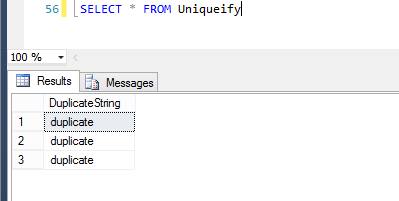
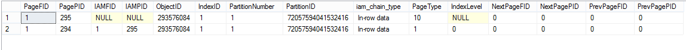
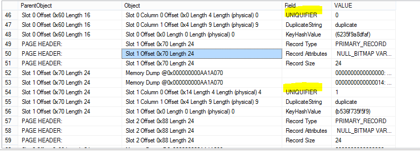
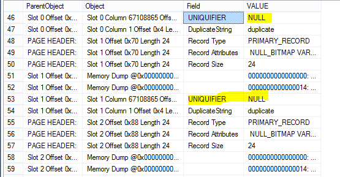

I did a post a couple weeks ago on the [basics of indexes in SQL Server](../2017-03-24-index-basics-sql-server/). One thing that I mentioned in passing is that if you create a clustered index on a column (or columns) with duplicate values, SQL Server will "uniqueify" the columns. This is cashed out in terms of a 4 byte value being attached to each duplicate item, but what does that even mean? What does it look like in SQL Server? How can you know if a value has been uniqueified? 

Well, let's find out.

### Setting the Stage

Let's make a test database and a very simple table:

```sql
CREATE DATABASE IndexTest;

USE IndexTest;

CREATE TABLE Uniqueify
(
DuplicateString CHAR(9) NOT NULL
);

INSERT INTO Uniqueify (DuplicateString) VALUES ('duplicate');
INSERT INTO Uniqueify (DuplicateString) VALUES ('duplicate');
INSERT INTO Uniqueify (DuplicateString) VALUES ('duplicate');
```

Here's what our minimalist table looks like:

| |__DuplicateString__|
|1|duplicate|
|2|duplicate|
|3|duplicate|

To quickly review: a clustered index results in the table physically being ordered in a certain way. We cannot put a _unique_ clustered index or a primary key (which creates a clustered index) on our table, because they insist that the values in the index or key are unique; if we tried to create one, we'd get an error that starts like this:

> The CREATE UNIQUE INDEX statement terminated because a duplicate key was found for the object name 'dbo.Uniqueify'

However, if we run

```sql
CREATE Clustered INDEX IX_Uniqueify_DuplicateString
ON Uniqueify (DuplicateString);
```

our command completes successfully. So, let's see what it did to our table...



...huh. Looks the same. I guess it's good that adding the index didn't change the values in our data, but what did it even do? We know that the clustered index put our three values in an order, but where does SQL Server store that order? To answer that, we have to dig a bit deeper into SQL Server.

### In Search of the Uniqueifier

__Note:__ For this part of the post, I am greatly indebted [to this post by Ken Simmons](https://www.mssqltips.com/sqlservertip/2082/understanding-and-examining-the-uniquifier-in-sql-server/).

To find the uniqueifier we have to go down to the page level. Under the hood, SQL stores your data in 8KB pages and these pages have more going on than just some rows and columns. To view information on the pages behind our table, we will need some DBCC commands. 

First, we will run __DBCC IND__. DBCC IND tells us the page numbers for the objects that we specify. In our case, we are going to look for the pages that contain our indexes 

```sql
DBCC IND (IndexTest, Uniqueify, -1)
```

(We use -1 for all indexes. See [this post](http://strictlysql.blogspot.com/2010/08/dbcc-ind-dbcc-page-intro.html) for documentation of DBCC IND).

This is what we get:



Hmmm there's two results. We could just jot down both pages numbers, but we actually know that 294 is the one that we want, because it has PageType = 1, and 1 means it's a data page. We can feed that page number into another DBCC function: __DBCC Page__, which will give us detailed information on whatever page we enter in. Since our database is "IndexTest" and our page is 294, we will run:

```sql
DBCC PAGE(IndexTest, 1,294, 3) WITH TABLERESULTS
```

which will give us a bunch of rows! If we scroll down and keep an eye on the "Field" column, we eventually hit something interesting:



There they are! What we see is that one of our instances of "duplicate" is assigned the uniqueifier 0, another is assigned 1, and if we scrolled down, we would see that the last is assigned 2. This is our glimpse into how SQL Server is ordering these three duplicate values behind the scenes. Nice!

Now, just for fun, we can demonstrate that these uniqueifiers on the page are from our clustered index. We can drop our clustered index,


```sql
DROP INDEX IX_Uniqueify_DuplicateString ON Uniqueify
```

run that same DBCC Page command, and we see...



...those uniqueifiers are gone.

And that's the story of how SQL Server makes uniqueifiers.