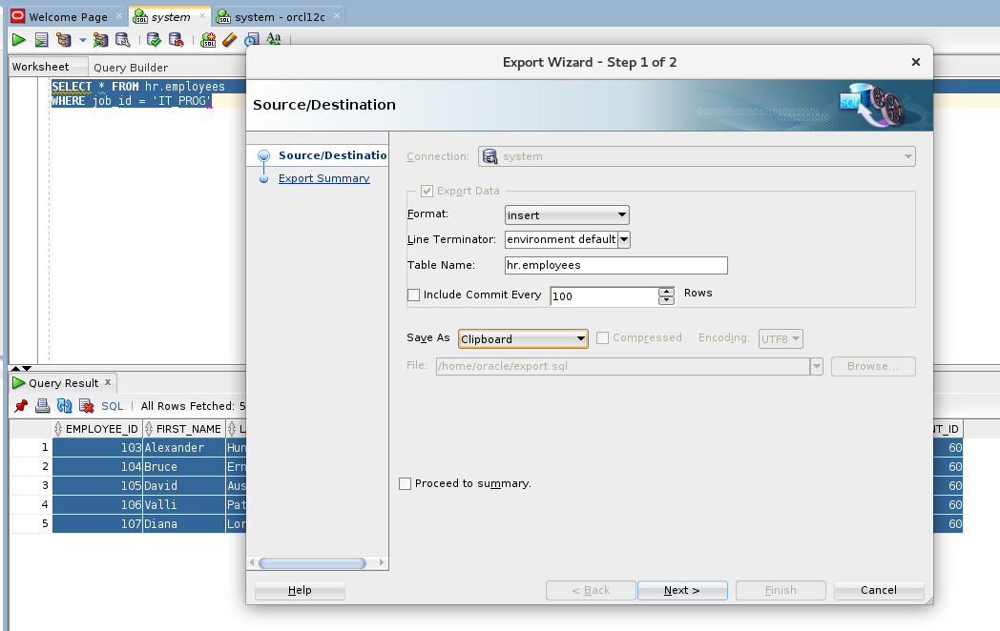
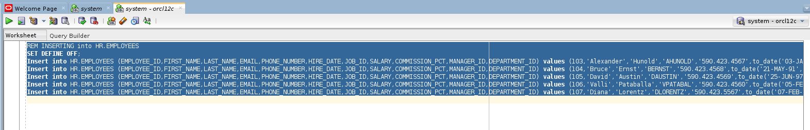

There are many guides and opinions how to most efficiently move large amounts of data between database instances. However, what I've had to do recently is just move a few rows of data between databases instances, and of course, I wanted to do this as efficiently as possible. Here's a nice way to do this using SQL Developer.

First, run a SELECT query that grabs exactly the data that you want to transfer. Then, right-click >> export. Keep the format as "insert", change the table name to whatever the table is that you're going to insert into, and select "Clipboard" for "Save As." Once you hit "next" and "finish", go to the connection that you're moving data to and press ctrl+V (or paste). You will have an insert query that will insert the data that you SELECTed.

Here's an example using the stock databases from Oracle (the virtual machine is [here](http://www.oracle.com/technetwork/database/enterprise-edition/databaseappdev-vm-161299.html)). We're going to just get all the IT_PROG employees:

Then we go to our other connection, paste, and we have what we need to move our records to the other database.

Nothing too fancy, but it gets the jobs done.